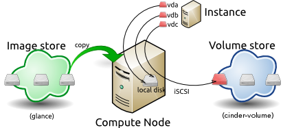

====================
Images and instances
====================

Virtual machine images contain a virtual disk that holds a
bootable operating system on it. Disk images provide templates for
virtual machine file systems. The Image service controls image storage
and management.

Instances are the individual virtual machines that run on physical
compute nodes inside the cloud. Users can launch any number of instances
from the same image. Each launched instance runs from a copy of the
base image. Any changes made to the instance do not affect
the base image. Snapshots capture the state of an instances
running disk. Users can create a snapshot, and build a new image based
on these snapshots. The Compute service controls instance, image, and
snapshot storage and management.

When you launch an instance, you must choose a ``flavor``, which
represents a set of virtual resources. Flavors define virtual
CPU number, RAM amount available, and ephemeral disks size. Users
must select from the set of available flavors
defined on their cloud. OpenStack provides a number of predefined
flavors that you can edit or add to.

.. note::

   -  For more information about creating and troubleshooting images,
      see the `OpenStack Virtual Machine Image
      Guide <https://docs.openstack.org/image-guide/>`__.

   -  For more information about image configuration options, see the
      `Image services <../configuration/index.html>`__
      section of the OpenStack Configuration Reference.

You can add and remove additional resources from running instances, such
as persistent volume storage, or public IP addresses. The example used
in this chapter is of a typical virtual system within an OpenStack
cloud. It uses the ``cinder-volume`` service, which provides persistent
block storage, instead of the ephemeral storage provided by the selected
instance flavor.

This diagram shows the system state prior to launching an instance. The
image store has a number of predefined images, supported by the Image
service. Inside the cloud, a compute node contains the
available vCPU, memory, and local disk resources. Additionally, the
``cinder-volume`` service stores predefined volumes.

|

.. _Figure Base Image:

**The base image state with no running instances**

|

Instance Launch
~~~~~~~~~~~~~~~

To launch an instance, select an image, flavor, and any optional
attributes. The selected flavor provides a root volume, labeled ``vda``
in this diagram, and additional ephemeral storage, labeled ``vdb``. In
this example, the ``cinder-volume`` store is mapped to the third virtual
disk on this instance, ``vdc``.

|

.. _Figure Instance creation:

**Instance creation from an image**

|

The Image service copies the base image from the image store to the
local disk. The local disk is the first disk that the instance
accesses, which is the root volume labeled ``vda``. Smaller
instances start faster. Less data needs to be copied across
the network.

The new empty ephemeral disk is also created, labeled ``vdb``.
This disk is deleted when you delete the instance.

The compute node connects to the attached ``cinder-volume`` using iSCSI. The
``cinder-volume`` is mapped to the third disk, labeled ``vdc`` in this
diagram. After the compute node provisions the vCPU and memory
resources, the instance boots up from root volume ``vda``. The instance
runs and changes data on the disks (highlighted in red on the diagram).
If the volume store is located on a separate network, the
``my_block_storage_ip`` option specified in the storage node
configuration file directs image traffic to the compute node.

.. note::

   Some details in this example scenario might be different in your
   environment. For example, you might use a different type of back-end
   storage, or different network protocols. One common variant is that
   the ephemeral storage used for volumes ``vda`` and ``vdb`` could be
   backed by network storage rather than a local disk.

When you delete an instance, the state is reclaimed with the exception
of the persistent volume. The ephemeral storage, whether encrypted or not,
is purged. Memory and vCPU resources are released. The image remains
unchanged throughout this process.

|

.. _End of state:

**The end state of an image and volume after the instance exits**

|

Image properties and property protection
~~~~~~~~~~~~~~~~~~~~~~~~~~~~~~~~~~~~~~~~

An image property is a key and value pair that the administrator
or the image owner attaches to an OpenStack Image service image, as
follows:

-  The administrator defines core properties, such as the image
   name.

-  The administrator and the image owner can define additional
   properties, such as licensing and billing information.

The administrator can configure any property as protected, which
limits which policies or user roles can perform CRUD operations on that
property. Protected properties are generally additional properties to
which only administrators have access. Further, Glance itself reserves
properties namespaced with the ``os_glance`` prefix for its own use.

For unprotected image properties, the administrator can manage
core properties and the image owner can manage additional properties.

**To configure property protection**

To configure property protection, edit the ``policy.yaml`` file. This file
can also be used to set policies for Image service actions.

#. Define roles or policies in the ``policy.yaml`` file:

   .. code-block:: json

      {
          "context_is_admin":  "role:admin",
          "default": "",

          "add_image": "",
          "delete_image": "",
          "get_image": "",
          "get_images": "",
          "modify_image": "",
          "publicize_image": "role:admin",
          "copy_from": "",

          "download_image": "",
          "upload_image": "",

          "delete_image_location": "",
          "get_image_location": "",
          "set_image_location": "",

          "add_member": "",
          "delete_member": "",
          "get_member": "",
          "get_members": "",
          "modify_member": "",

          "manage_image_cache": "role:admin",

          "get_task": "",
          "get_tasks": "",
          "add_task": "",
          "modify_task": "",

          "deactivate": "",
          "reactivate": "",

          "get_metadef_namespace": "",
          "get_metadef_namespaces":"",
          "modify_metadef_namespace":"",
          "add_metadef_namespace":"",
          "delete_metadef_namespace":"",

          "get_metadef_object":"",
          "get_metadef_objects":"",
          "modify_metadef_object":"",
          "add_metadef_object":"",
          "delete_metadef_object":"",

          "list_metadef_resource_types":"",
          "get_metadef_resource_type":"",
          "add_metadef_resource_type_association":"",
          "remove_metadef_resource_type_association":"",

          "get_metadef_property":"",
          "get_metadef_properties":"",
          "modify_metadef_property":"",
          "add_metadef_property":"",
          "remove_metadef_property":"",

          "get_metadef_tag":"",
          "get_metadef_tags":"",
          "modify_metadef_tag":"",
          "add_metadef_tag":"",
          "add_metadef_tags":"",
          "delete_metadef_tag":"",
          "delete_metadef_tags":""
       }

   For each parameter, use ``"rule:restricted"`` to restrict access to all
   users or ``"role:admin"`` to limit access to administrator roles.
   For example:

   .. code-block:: json

      {
          "download_image":
          "upload_image":
      }

#. Define which roles or policies can manage which properties in a property
   protections configuration file. For example:

   .. code-block:: ini

      [x_none_read]
      create = context_is_admin
      read = !
      update = !
      delete = !

      [x_none_update]
      create = context_is_admin
      read = context_is_admin
      update = !
      delete = context_is_admin

      [x_none_delete]
      create = context_is_admin
      read = context_is_admin
      update = context_is_admin
      delete = !

   -  A value of ``@`` allows the corresponding operation for a property.

   -  A value of ``!`` disallows the corresponding operation for a
      property.

#. In the ``glance-api.conf`` file, define the location of a property
   protections configuration file.

   .. code-block:: ini

      property_protection_file = {file_name}

   This file contains the rules for property protections and the roles and
   policies associated with it.

   By default, property protections are not enforced.

   If you specify a file name value and the file is not found, the
   ``glance-api`` service does not start.

   To view a sample configuration file, see
   `glance-api.conf <../configuration/glance_api.html>`__.

#. Optionally, in the ``glance-api.conf`` file, specify whether roles or
   policies are used in the property protections configuration file

   .. code-block:: ini

      property_protection_rule_format = roles

   The default is ``roles``.

   To view a sample configuration file, see
   `glance-api.conf <../configuration/glance_api.html>`__.

Image download: how it works
~~~~~~~~~~~~~~~~~~~~~~~~~~~~

Prior to starting a virtual machine, transfer the virtual machine image
to the compute node from the Image service. How this
works can change depending on the settings chosen for the compute node
and the Image service.

Typically, the Compute service will use the image identifier passed to
it by the scheduler service and request the image from the Image API.
Though images are not stored in glance—rather in a back end, which could
be Object Storage, a filesystem or any other supported method—the
connection is made from the compute node to the Image service and the
image is transferred over this connection. The Image service streams the
image from the back end to the compute node.

It is possible to set up the Object Storage node on a separate network,
and still allow image traffic to flow between the compute and object
storage nodes. Configure the ``my_block_storage_ip`` option in the
storage node configuration file to allow block storage traffic to reach
the compute node.

Certain back ends support a more direct method, where on request the
Image service will return a URL that links directly to the back-end store.
You can download the image using this approach. Currently, the only store
to support the direct download approach is the filesystem store.
Configured the approach using the ``filesystems`` option in
the ``image_file_url`` section of the ``nova.conf`` file on
compute nodes.

Compute nodes also implement caching of images, meaning that if an image
has been used before it won't necessarily be downloaded every time.
Information on the configuration options for caching on compute nodes
can be found in the `Configuration
Reference <../configuration/>`__.

Instance building blocks
~~~~~~~~~~~~~~~~~~~~~~~~

In OpenStack, the base operating system is usually copied from an image
stored in the OpenStack Image service. This results in an ephemeral
instance that starts from a known template state and loses all
accumulated states on shutdown.

You can also put an operating system on a persistent volume in Compute
or the Block Storage volume system. This gives a more traditional,
persistent system that accumulates states that are preserved across
restarts. To get a list of available images on your system, run:

.. code-block:: console

   $ glance image-list
   +--------------------------------------+-----------------------------+
   | ID                                   | Name                        |
   +--------------------------------------+-----------------------------+
   | aee1d242-730f-431f-88c1-87630c0f07ba | Ubuntu 14.04 cloudimg amd64 |
   +--------------------------------------+-----------------------------+
   | 0b27baa1-0ca6-49a7-b3f4-48388e440245 | Ubuntu 14.10 cloudimg amd64 |
   +--------------------------------------+-----------------------------+
   | df8d56fc-9cea-4dfd-a8d3-28764de3cb08 | jenkins                     |
   +--------------------------------------+-----------------------------+

The displayed image attributes are:

``ID``
    Automatically generated or user provided UUID of the image.

``Name``
    Free form, human-readable name for the image.

Virtual hardware templates are called ``flavors``, and are defined by
administrators. Prior to the Newton release, a default installation also
includes five predefined flavors.

For a list of flavors that are available on your system, run:

.. code-block:: console

   $ openstack flavor list
   +-----+-----------+-------+------+-----------+-------+-----------+
   | ID  | Name      |   RAM | Disk | Ephemeral | VCPUs | Is_Public |
   +-----+-----------+-------+------+-----------+-------+-----------+
   | 1   | m1.tiny   |   512 |    1 |         0 |     1 | True      |
   | 2   | m1.small  |  2048 |   20 |         0 |     1 | True      |
   | 3   | m1.medium |  4096 |   40 |         0 |     2 | True      |
   | 4   | m1.large  |  8192 |   80 |         0 |     4 | True      |
   | 5   | m1.xlarge | 16384 |  160 |         0 |     8 | True      |
   +-----+-----------+-------+------+-----------+-------+-----------+

By default, administrative users can configure the flavors. You can
change this behavior by redefining the access controls for
``compute_extension:flavormanage`` in ``/etc/nova/policy.yaml`` on the
``compute-api`` server.

Instance management tools
~~~~~~~~~~~~~~~~~~~~~~~~~

OpenStack provides command-line, web interface, and API-based instance
management tools. Third-party management tools are also available, using
either the native API or the provided EC2-compatible API.

The OpenStack python-openstackclient package provides a basic command-line
utility, which uses the :command:`openstack` command.
This is available as a native package for most Linux distributions,
or you can install the latest version using the pip python package installer:

.. code-block:: console

   # pip install python-openstackclient

For more information about python-openstackclient and other command-line
tools, see the `OpenStack End User Guide <../cli/index.html>`__.

Latest image management tools can be installed using the pip package manager:

.. code-block:: console

   # pip install python-glanceclient

This package provides you the :command:`glance` for managing all your images.

Control where instances run
~~~~~~~~~~~~~~~~~~~~~~~~~~~

The `Scheduling section
<https://docs.openstack.org/nova/latest/user/filter-scheduler.html>`__
of OpenStack Configuration Reference
provides detailed information on controlling where your instances run,
including ensuring a set of instances run on different compute nodes for
service resiliency or on the same node for high performance
inter-instance communications.

Administrative users can specify which compute node their instances
run on. To do this, specify the ``--availability-zone
AVAILABILITY_ZONE:COMPUTE_HOST`` parameter.

Launch instances with UEFI
~~~~~~~~~~~~~~~~~~~~~~~~~~

Unified Extensible Firmware Interface (UEFI) is a standard firmware
designed to replace legacy BIOS. There is a slow but steady trend
for operating systems to move to the UEFI format and, in some cases,
make it their only format.

**To configure UEFI environment**

To successfully launch an instance from an UEFI image in QEMU/KVM
environment, the administrator has to install the following
packages on compute node:

-  OVMF, a port of Intel's tianocore firmware to QEMU virtual machine.

-  libvirt, which has been supporting UEFI boot since version 1.2.9.

Because default UEFI loader path is ``/usr/share/OVMF/OVMF_CODE.fd``, the
administrator must create one link to this location after UEFI package
is installed.

**To upload UEFI images**

To launch instances from a UEFI image, the administrator first has to
upload one UEFI image. To do so, ``hw_firmware_type`` property must
be set to ``uefi`` when the image is created. For example:

.. code-block:: console

   $ glance image-create-via-import --container-format bare \
     --disk-format qcow2 --property hw_firmware_type=uefi \
     --file /tmp/cloud-uefi.qcow --name uefi

After that, you can launch instances from this UEFI image.
